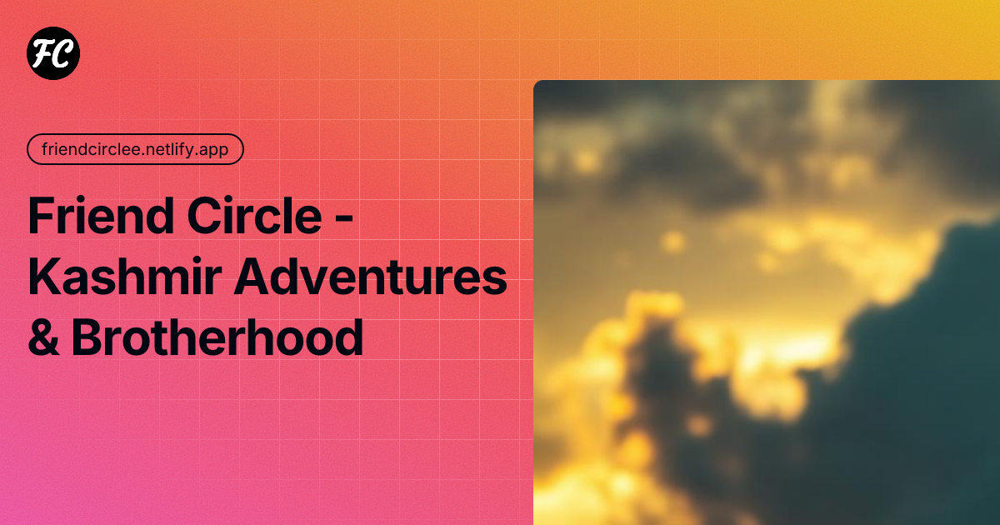

<div align="center">
  

  **A Next-Generation Tactical Adventure & Islamic Lifestyle Platform**

  [](https://nextjs.org/)
  [](https://mongodb.com)
  [](https://tailwindcss.com/)
  [](https://framer.com/motion/)
  []()
  
  [](https://opensource.org/licenses/MIT)
  []()
</div>

<br />

## 📖 System Overview

**Friend Circle** is a high-performance, full-stack web application engineered for the modern Muslim adventurer. Built with a highly premium, "military command console" aesthetic (bone, ink, and signal colors), it seamlessly bridges the gap between tactical outdoor coordination (offroading, hiking, convoys) and daily spiritual discipline (Tazkiyah).

<div align="center">
  
  <br/>
  <i>No ridge is bigger than Fajr.</i>
</div>

---

## ✨ Core Modules & Features

### ⚔️ Tactical & Live-Ops (Command Console)
- **Admin Dashboard:** A heavily stylized, operator-style UI for live-ops tracking, user verification, and telemetry.
- **Analytics & Telemetry:** Integrated with `recharts` to provide actionable, visual insights on financial health, tours, and engagement.
- **Convoy & Loadout System:** Dynamic payload calculation, gear packing lists, and real-time mock telemetry for tracking off-road convoys.
- **Progressive Web App (PWA):** Fully installable on iOS and Android devices with offline-mode capabilities using Service Workers and IndexedDB.

### 🕌 Tazkiyah (Spiritual Discipline)
- **Live AR Qibla Finder:** A custom-built, device-hardware powered Augmented Reality HUD. It uses geodesic math and phone magnetometers/gyroscopes to point operators precisely to Makkah in real-time.
- **Advanced Quran Reader:** Features beautiful Arabic typography, clean layouts, and immersive reading views.
- **Daily Companions:** Interactive Asma-ul-Husna (99 Names of Allah), Daily Hadith, and digital Tasbih with haptic-like animations.
- **Live Prayer Times:** Live integration with the Aladhan API to track prayer times globally, complete with a tactical countdown to the next prayer.

---

## 🎨 The Aesthetic Philosophy

Friend Circle isn't just an app; it's an experience. The UI/UX is deeply inspired by military HUDs, terminal interfaces, and high-end tactical gear. 
- **Typography:** Monospace fonts for data readouts paired with elegant serifs for Arabic text.
- **Color Palette:** High contrast "Ink" (deep black), "Bone" (off-white), and "Signal" (tactical green/orange).
- **Micro-interactions:** Extensive use of `framer-motion` for spring-physics animations, blurred backdrops (glassmorphism), and CRT-style scanline overlays.

<div align="center">
  
  <br/>
  <i>(Tactical HUD & AR Systems)</i>
</div>

---

## 🏗 System Architecture

Friend Circle is built on a modern **MERN stack** adapted for the serverless edge:

- **Frontend & Routing:** React 19 and Next.js (App Router) for hybrid Server-Side Rendering (SSR) and Client-Side rendering.
- **State & Animations:** Heavy utilization of `framer-motion` for complex micro-animations and layout transitions.
- **Database Layer:** MongoDB with Mongoose ODMs, featuring optimized schema designs for Trip Memories, Operator Profiles, and Ledger finances.
- **Authentication:** Highly secure `NextAuth.js` implementation supporting Credentials (OTP) and OAuth providers.
- **Media Optimization:** `ImageKit.io` integration combined with on-device browser image compression to handle high-res expedition photos efficiently.
- **Edge Deployment:** Configured with `netlify.toml` for seamless edge deployment and caching on Netlify.

---

## 🚀 Future Roadmap

- [ ] **Real-Time GPS Tracking:** WebSocket integration for live convoy tracking on a tactical map.
- [ ] **Offline Maps Integration:** Mapbox GL integration with downloadable regions for deep-wilderness operations.
- [ ] **Enhanced Admin Roles:** Granular permissions for "Commanders", "Medics", and "Operators".
- [ ] **Push Notifications:** Web Push API integration for prayer time alerts and convoy distress signals.

---

## ⚙️ Local Setup & Installation

**1. Clone the repository:**
```bash
git clone https://github.com/Zuhaib-dev/Friend-circle.git
cd Friend-circle
```

**2. Install dependencies:**
```bash
npm install
```

**3. Configure Environment Variables:**
Create a `.env.local` file in the root directory:
```env
# Database
MONGODB_URI=mongodb+srv://<username>:<password>@cluster.mongodb.net/friend-circle

# Authentication
NEXTAUTH_SECRET=your_super_secret_string
NEXTAUTH_URL=http://localhost:3000

# Media Handling
NEXT_PUBLIC_IMAGEKIT_URL_ENDPOINT=https://ik.imagekit.io/your_id
NEXT_PUBLIC_IMAGEKIT_PUBLIC_KEY=your_public_key
IMAGEKIT_PRIVATE_KEY=your_private_key
```

**4. Engage Systems:**
```bash
npm run dev
```
Navigate to `http://localhost:3000` to access the command console.

---

## 👨‍💻 Author & Architect

**Zuhaib**  
*Full-Stack Engineer & UI/UX Designer*

I build high-performance, aesthetically striking web applications. Friend Circle is a testament to blending complex system architecture with premium, immersive design.

- 🌐 **Portfolio:** [zuhaibrashid.com](https://zuhaibrashid.com)
- 🐙 **GitHub:** [@Zuhaib-dev](https://github.com/Zuhaib-dev)
- 💼 **LinkedIn:** [linkedin.com/in/zuhaib](https://www.linkedin.com/in/zuhaib-rashid-661345318/)
- 𝕏 **Twitter/X:** [@xuhaib_x9](https://x.com/xuhaib_x9)

---
<div align="center">
  <i>Built with precision and purpose. No ridge is bigger than Fajr.</i>
</div>
